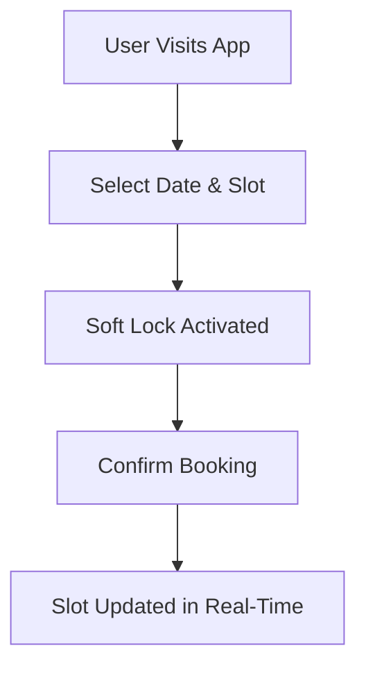

# 🚗✨ Parkly – Smart Parking Management System  
Live App: https://parkly-hack.vercel.app/

<p align="center">
  <a href="https://parkly-hack.vercel.app/">
    
  </a>
  <a href="https://github.com/riyagoyal08010-glitch/Parkly_Hack">
    
  </a>
  <a href="https://github.com/riyagoyal08010-glitch/Parkly_Hack/network/members">
    
  </a>
  <a href="https://github.com/riyagoyal08010-glitch/Parkly_Hack/issues">
    
  </a>
</p>

<p align="center">
  
  
  
</p>

---

## 🌟 Overview  

**Parkly** is a smart parking management system designed to eliminate the hassle of finding parking in urban areas.  

It allows users to discover, reserve, and manage parking slots in real-time while being ready for future AI-powered integrations like number plate recognition 🚀  

---

## ✨ Features  

- 🚘 Real-time parking availability  
- 📅 Smart slot booking system  
- 🔒 Soft lock to prevent double booking  
- ⚡ Dynamic slot updates  
- 🧠 AI-ready architecture (Number Plate Detection)  
- 🎨 Clean and intuitive UI  

---

## 🧠 Problem → Solution  

| Problem 🚫 | Solution ✅ |
|----------|-----------|
| Time wasted finding parking | Real-time slot availability |
| Double booking issues | Soft lock system |
| Manual tracking | Automated system |
| No smart integration | AI-ready architecture |

---

## 🛠️ Tech Stack  

<p align="center">
  
</p>

---

## ⚙️ How It Works  



---

## 🚀 Getting Started  

```bash
# Clone repo
git clone https://github.com/riyagoyal08010-glitch/Parkly_Hack.git

# Go to folder
cd Parkly_Hack

# Install dependencies
npm install

# Run server
npm start
```

---


## 🔮 Future Scope  

- 🤖 AI Number Plate Recognition  
- 📱 Mobile App  
- 💳 Payment Integration  
- 🗺️ Map-based slot visualization  
- 🔔 Smart notifications  

---


## 🏆 Hackathon Project  

Built with speed, creativity, and real-world impact in mind 💡  

---

## 📄 License  

MIT License  

---

## 💖 Support  

If you like this project:  

- ⭐ Star the repo  
- 🍴 Fork it  
- 📢 Share it  
